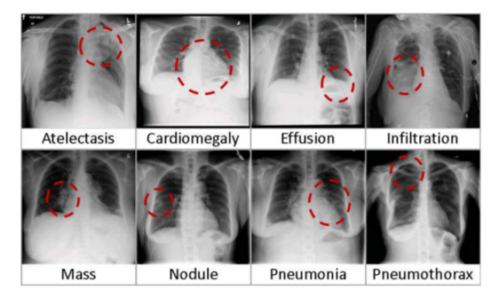

Code Lab 3: ChestX-ray8, National Institutes of Health Chest X-Ray Dataset
===

These are the materials for the third code lab in Curae.ai's Deep Learning in Healthcare Workshop.

The notebook in this lab is only a baseline notebook meant to help users download the dataset and document its formatting. Users will compete using this multilabel classification in the Curae.ai DLWH competition.  Class is over! You are ready.

## Instructions for the competition
TBD

## References:
[1] Wang X, Peng Y, Lu L, Lu Z, Bagheri M, Summers RM. ChestX-ray8: Hospital-scale Chest X-ray Database and Benchmarks on Weakly-Supervised Classification and Localization of Common Thorax Diseases. IEEE CVPR 2017, ChestX-ray8_Hospital-Scale_Chest_CVPR_2017_paper.pdf

[2] NIH News release: NIH Clinical Center provides one of the largest publicly available chest x-ray datasets to scientific community

[3] Original source files and documents: https://nihcc.app.box.com/v/ChestXray-NIHCC/folder/36938765345

